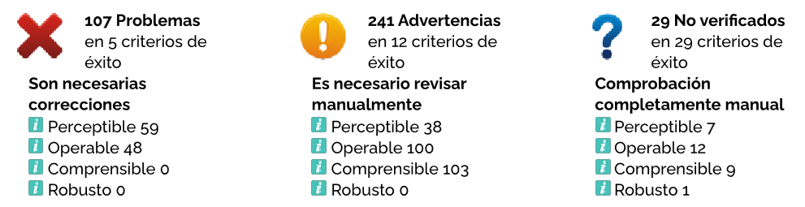
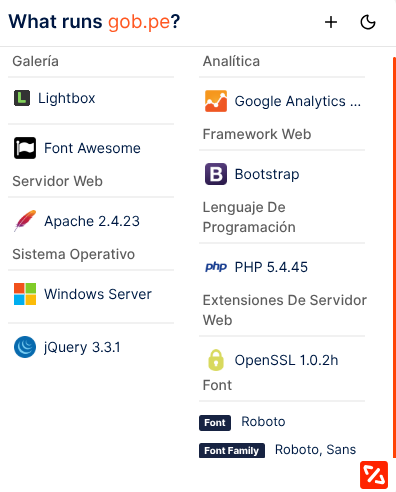
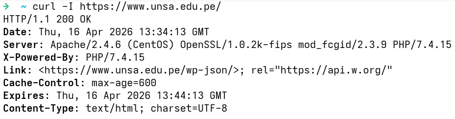

# Práctica : Accesibilidad web
| Autores | Rol | Porcentaje |
| :--- | :--- | :---: |
| Richart Escobedo | Prueba de herramientas para evaluar accesibilidad | 100% |
| Richart Escobedo | Elaboración del informe | 100% |
| | **Total** | **100%** |

| Entregables | URL |
| :--- | :--- |
| Repositorio | https://github.com/rescobedoulasalle/iw.git |
| Laboratorio | https://github.com/rescobedoulasalle/iw/tree/main/prac-accesibilidad |
| Informe | https://github.com/rescobedoulasalle/iw/prac-accesibilidad/IW_prac_accesibilidad.pdf |

# Descripción de la práctica
- Utilizar la herramienta [TAW](https://www.tawdis.net/) o similares para evaluar la accesibilidad web (Perceptible, Operable, Comprensible, Robusto).
- Utilizar la herramienta [Contrast Checker](https://webaim.org/resources/contrastchecker/) para realizar una prueba de contraste de color (para personas con baja visión y daltonismo).
- Desactivar JavaScript y probar la navegación y la funcionalidad.
- Probar la navegación sólo con el teclado (enlaces, botones, formularios). [Foco][Orden]
- Probar el acceso desde pantallas de dispositivos móviles (omisión de elementos del DOM).
- Comprobar las tecnologías web del sitio (servidor web, frameworks, lenguaje de programación y plataformas).
- Realizar el análisis, detallar y proponer la corrección de errores (agregar anexos).

# Entregables
- Informe de práctica en formato Markdown y PDF (enviar en la tarea de Classroom). [IW_prac_accesibilidad.pdf]
- Repositorio de GitHub que contenga los archivos, anexos e imágenes de su investigación.

## Crear PDF a partir del README.md
```bash
pandoc README.md -o IW_prac_accesibilidad.pdf
```

## Referencias
- [TAW](https://www.tawdis.net/)
- [Contrast Checker](https://webaim.org/resources/contrastchecker/)
- [No Script](https://noscript.net/)
- [Lynx text web browser](https://lynx.invisible-island.net/)
- [Curl](https://curl.se/)
- [Herramientas automáticas para evaluar y mejorar la accesibilidad web
](https://www.youtube.com/watch?v=Xxleh0L55_o&t=340s)
- [Ejercicio del curso: análisis de la accesibilidad web con WAVE y de forma manual
](https://www.youtube.com/watch?v=7_5uN9gh-tU&t=616s)
- [Evaluación de la accesibilidad. Cuando los test automáticos son insuficientes
](https://www.youtube.com/watch?v=msJI4Z5Ra0E&t=457s)
- [Markup Validation Service](https://validator.w3.org/)
- [CSS Validation Service](https://jigsaw.w3.org/css-validator/)
- [Mobile Checker Report](https://www.w3.org/2016/11/mobile-checker-disabled/)
- [Link Checker](https://validator.w3.org/checklink)
- [Validator and tools](https://www.w3.org/developers/tools/)


## Pantallas




## Rúbrica de calificación
| ítem | Descripción | Puntaje |
| :--- | :--- | :---: |
| **TAW** | Uso de una herramienta para evaluar la accesibilidad web | 3 |
| **Contraste de color** | Realiza una prueba de contraste de color | 3 |
| **NoJS** | Prueba de navegación y la funcionalidad sin JS | 3 |
| **Keyboard** | Prueba de navegación sólo con el teclado | 3 |
| **Móvil** | Prueba el acceso desde pantallas de dispositivos móviles | 3 |
| **WhatRuns** | Comprueba las tecnologías web del sitio | 2 |
| **Informe** | El laboratorio tiene un README.md que detalla toda la práctica | 3 |
| **Prueba[^1]** | Se tomaron en cuenta todas las consideraciones y recomendaciones, lo que evidencia un trabajo en equipo | -0 |

Si el docente solicita un video, debe cargarse en Youtube o Drive y sólo debe entregarse la URL pública, sin que se solicite login alguno. Es recomendable incluir la URL tanto en el README.md como en el informe.

[^1]: El docente debe comprobar el cumplimiento de todas las consideraciones y recomendaciones, evidenciando el trabajo en equipo con responsabilidad y la práctica de la ética profesional, a fin de no aplicar ninguna penalidad.
