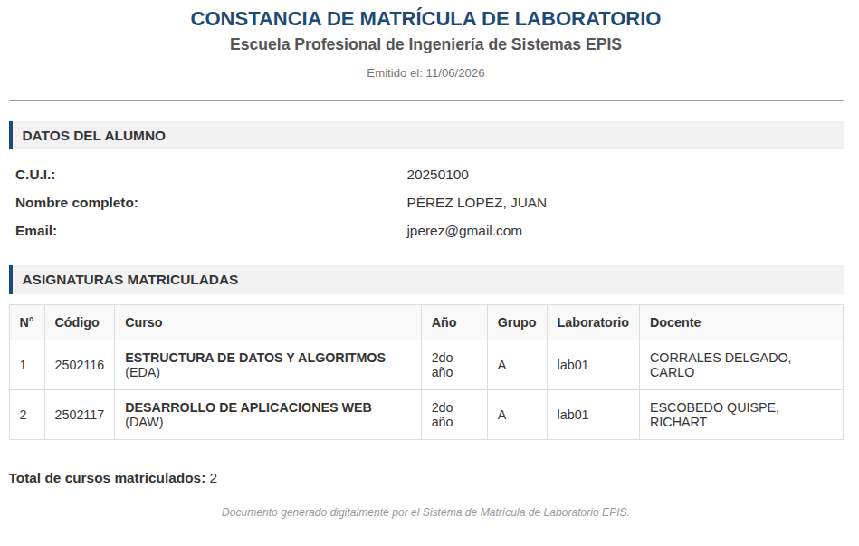

# Practica : Framework frontend
| Autores | Rol | Rama | Comits | Tareas | Porcentaje |
| :--- | :--- | :---: | :---: | :--- | :---: |
| Richart Escobedo | Backend | rescobedoq | 40 | Instalación y configuracion del framework | 100% |
| Richart Escobedo | Frontedn | rescobedoq  | 20 | Programación de componente constancia | 100% |
| Richart Escobedo | Frontedn | rescobedoq  | 15 | Desplieque en plataforma CDN | 100% |
| Richart Escobedo | FullStack | rescobedoq  | 15 | Elaboración del informe | 100% |
| **Total**|  |  | 90 |  | **100%** |

| Entregables | URL |
| :--- | :--- |
| Repositorio | https://github.com/rescobedoulasalle/sisacad-enrollments-frontend.git |
| Video | https://youtube.com/... |
| Informe | https://github.com/rescobedoulasalle/sisacad-enrollments-frontend/blob/main/informes/IW_prac_frontend.pdf |

# Descripción de la práctica
- Consume JSON anidados estratégicos para satisfacer necesidades de sus usuarios finales.
- Desabilitar autenticación JWT solamente para la vista involucrada (protegiendo la modificación con ReadOnly) permitiendo las operaciones GET.
- Registrar URLs para consumir la API REST framework.
- Capturar pantallas de la API y del frontend. 
- Elaborar README.md.
- Agregar URLs backend y frontend desplegados en la nube en plataformas CDN o hosting.
  
# Entregables
- Informe de práctica en PDF (enviar en la tarea de Classroom). [IW_prac_frontend.pdf]
- Video de demostración donde el frontend solicita información al backend y produce una interfaz.
- Repositorio de GitHub que contenga los archivos, anexos e imágenes de su investigación.

## Rúbrica de calificación[^1]
| ítem | Descripción | Puntaje |
| :--- | :--- | :---: |
| **package.json** | Definición y explicación de las librerías utilizadas(informe). | 4 |
| **Instalación y configuración del framework** | Realiza detalladamente los pasos para instalar y configurar el framework frontend. | 4 |
| **Componentes** | Crea componentes(vistas) para producir interfaces donde se muestre la información enviada desde el backend. | 4 |
| **Informe** | El laboratorio tiene un informe que detalla todos los pasos necesarios para el desarrollo de la práctica. | 4 |
| **Deploy** | El laboratorio pone a disposición en una plataforma en la nube CDN o hosting las URLs del backend y frontend. | 4 |
| **Prueba[^2]** | Se tomaron en cuenta todas las consideraciones y recomendaciones, lo que evidencia un trabajo en equipo. | -0 |
|  | **Total** | **20** |

Si el docente solicita un video, debe cargarse en Youtube o Drive y sólo debe entregarse la URL pública, sin que se solicite login alguno. Es recomendable incluir la URL tanto en el README.md como en el informe.

[^1]: La autocalificación es obligatoria.
[^2]: El docente debe comprobar el cumplimiento de todas las consideraciones y recomendaciones, evidenciando el trabajo en equipo con responsabilidad y la práctica de la ética profesional, a fin de no aplicar ninguna penalidad.

## Referencias
- https://vuejs.org/
- https://es.vuejs.org/v2/guide/custom-directive
- https://router.vuejs.org/
- https://v2.vuejs.org/v2/cookbook/using-axios-to-consume-apis.html?redirect=true
- https://www.geeksforgeeks.org/javascript/vue-js/
- https://www.geeksforgeeks.org/javascript/getting-started-with-vuejs/
- https://www.geeksforgeeks.org/blogs/vue-js-roadmap/
- https://www.geeksforgeeks.org/javascript/vuejs-component/
- https://www.netlify.com/
- https://certificates.dev/vuejs

## Comunicación BackEnd-FrontEnd

### Caso JSON para mostrar Constancia de matrícula
- Método        : GET
- URL Backend   : https://sisacad-enrollments-backend.vercel.app/restful/enrollment-certificate/?cui=20250100
- URL FrontEnd  : https://sisacad-enrollments-frontend.netlify.app/constancia/20250100



- BODY respuesta:
```json
{
    "count": 2,
    "next": null,
    "previous": null,
    "results": [
        {
            "id": 4,
            "student": {
                "cui": 20250100,
                "full_name": "PÉREZ LÓPEZ, JUAN",
                "email": "jperez@gmail.com"
            },
            "workload": {
                "id": 3,
                "course": {
                    "id": "c0d28e46-5d67-433d-8b65-14dc773d7865",
                    "code": "2502116",
                    "name": "ESTRUCTURA DE DATOS Y ALGORITMOS",
                    "acronym": "EDA",
                    "credits": "4.00",
                    "year_display": "2do año",
                    "semester_display": "III semestre"
                },
                "group": "A",
                "laboratory": "lab01",
                "teacher": {
                    "full_name": "CORRALES DELGADO, CARLO",
                    "email": null
                }
            },
            "created": "2026-06-11T05:51:47.725798-05:00"
        },
        {
            "id": 1,
            "student": {
                "cui": 20250100,
                "full_name": "PÉREZ LÓPEZ, JUAN",
                "email": "jperez@gmail.com"
            },
            "workload": {
                "id": 1,
                "course": {
                    "id": "88430c3a-114e-4d8e-939d-c4c6c1dcc072",
                    "code": "2502117",
                    "name": "DESARROLLO DE APLICACIONES WEB",
                    "acronym": "DAW",
                    "credits": "4.00",
                    "year_display": "2do año",
                    "semester_display": "III semestre"
                },
                "group": "A",
                "laboratory": "lab01",
                "teacher": {
                    "full_name": "ESCOBEDO QUISPE, RICHART",
                    "email": null
                }
            },
            "created": "2026-06-08T12:55:32.119878-05:00"
        }
    ]
}
```
